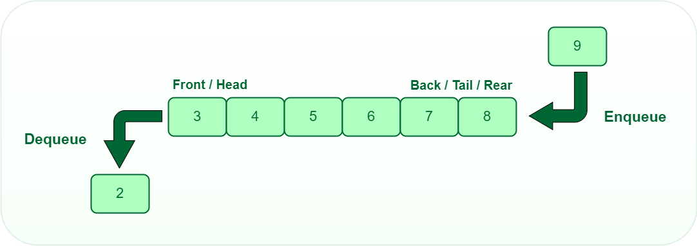

Procedendo in modo iterativo e incrementale, sviluppare un modulo
charArrayQueueADT.c che implementa una coda di caratteri (char)
tramite un array circolare dinamico.

In particolare, il modulo deve soddisfare la specifica charQueueADT.h:

/* Un tipo di dato astratto per le code di char */
typedef struct charQueue *CharQueueADT;

/* @brief Restituisce una coda vuota, se non trova memoria restituisce NULL */
CharQueueADT mkQueue();

/* @brief Distrugge la coda, recuperando la memoria */
void dsQueue(CharQueueADT *pq);

/* @brief Aggiunge un elemento in fondo alla coda, restituisce esito 0/1 */
_Bool enqueue(CharQueueADT q, const char e);

/* @brief Toglie e restituisce l'elemento in testa alla coda, restituisce esito 0/1 */
_Bool dequeue(CharQueueADT q, char*res);

/* @brief Controlla se la coda è vuota */
_Bool isEmpty(CharQueueADT q);

/* @brief Restituisce il numero degli elementi presenti nella coda */
int size(CharQueueADT q);

/* @brief Restituisce l'elemento nella posizione data (a partire dalla testa con indice zero) (senza toglierlo), restituisce esito 0/1 */
_Bool peek(CharQueueADT q, int position, char* res);

e deve utilizzare la struttura concreta charQueue (basata su array) definita qui:

#include "charQueueADT.h"

/* il valore 8 può essere cambiato */
#define INITIAL_CAPACITY 8

struct charQueue {
    int capacity; /* capacity == INITIAL CAPACITY*2^n, per qualche numero naturale n >= 0 */
    char* a; /* array, di dimensione capacity, che memorizza gli elementi presenti nella coda */
    int size; /* numero di elementi presenti nella coda (0 <= size <= capacity) */
    int rear; /* prima posizione libera in a (dove sarà memorizzato il prossimo elemento della coda (0 <= rear <= capacity-1) */
    int front; /* posizione in a dove (se size > 0) è memorizzato il primo elemento della coda (0 <= front <= capacity-1) */
    /* (front==rear) se e solo se ((size == 0) || (size == capacity)) */
    /* Gli elementi della coda sono in: a[front..rear-1] se rear > front, e in a[front..capacity-1],a[0..rear-1], se rear <= front */
    /* L'array si espande di un fattore due quando si riempie, e si dimezza (se capacity > INITIAL_CAPACITY) */
    /* quando size scende a capacity/4 (parametri personalizzabili) */      
    /* Se capacity > INITIAL_CAPACITY, allora il numero di elementi in coda è >= capacity/4 */
};
