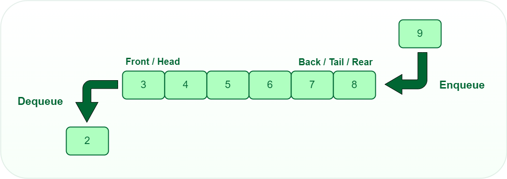

# Progetto 4

Procedendo in modo iterativo e incrementale, sviluppare un modulo
charLinkedListQueueADT.c che implementa una coda di caratteri (char)
tramite una lista linkata.

In particolare, il modulo deve soddisfare la specifica charQueueADT.h:

charQueueADT.h

e deve utilizzare la struttura concreta charQueue definita qui:

linkedListQueue.h

## charQueueADT.h

/* Un tipo di dato astratto per le code di char */
typedef struct charQueue *CharQueueADT;

/* @brief Restituisce una coda vuota, se non trova memoria restituisce NULL */
CharQueueADT mkQueue();

/* @brief Distrugge la coda, recuperando la memoria */
void dsQueue(CharQueueADT *pq);

/* @brief Aggiunge un elemento in fondo alla coda, restituisce esito 0/1 */
_Bool enqueue(CharQueueADT q, const char e);

/* @brief Toglie e restituisce l'elemento in testa alla coda, restituisce esito 0/1 */
_Bool dequeue(CharQueueADT q, char*res);

/* @brief Controlla se la coda è vuota */
_Bool isEmpty(CharQueueADT q);

/* @brief Restituisce il numero degli elementi presenti nella coda */
int size(CharQueueADT q);

/* @brief Restituisce l'elemento nella posizione data (a partire dalla testa con indice zero) (senza toglierlo), restituisce esito 0/1 */
_Bool peek(CharQueueADT q, int position, char* res);

## linkedListQueue.h

#include "charQueueADT.h"

typedef struct listNode ListNode, *ListNodePtr;
struct listNode {
    char data;
    ListNodePtr next;
};

struct charQueue {
    ListNodePtr front; /* Punta al primo nodo della lista, che contiene l'elemento in testa alla coda, se la coda è vuota vale NULL */
    ListNodePtr rear; /* Punta all'ultimo nodo della lista, che contiene l'elemento in fondo alla coda, se la coda è vuota vale NULL */

    /* aggiungere eventuali altre variabili per ottenere una implementazione più efficiente */
};